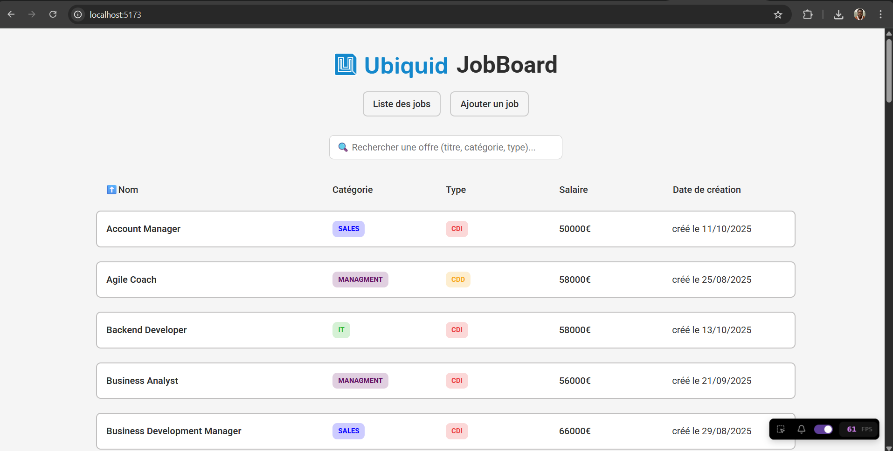
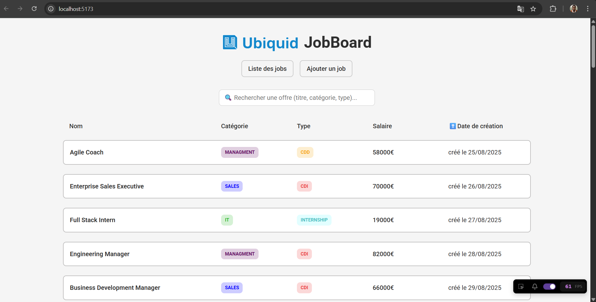
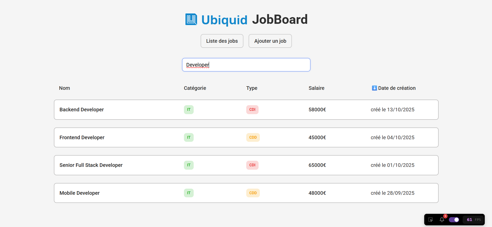
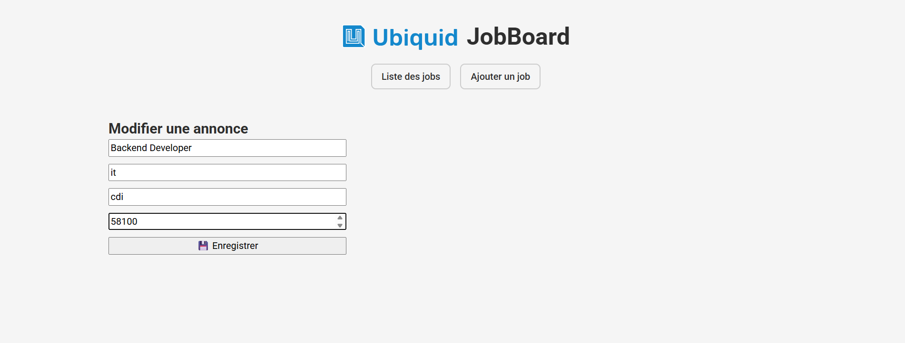

# Test technique - Développeur Web


## Introduction

- Ce test a pour but d’évaluer vos compétences en développement web fullstack (Node.js / React) à travers la mise en place d’une application de gestion d’offres d’emploi.

## Prérequis

- Node.js LTS (v22) — à installer de préférence via [NVM](https://github.com/nvm-sh/nvm)
- Un compte [Github](https://github.com)

## Installation du projet

- Créer un nouveau repository (sur votre compte perso) à partir de ce [template](https://github.com/adam-ubiquid/test_technique)


- Le projet est découpé en deux packages :
  - L’interface utilisateur : `/packages/ui`
  - L’API backend : `/packages/api`

### Étapes :

```bash
# UI
cd /packages/ui
npm install
npm run dev

# API
cd /packages/api
npm install
npm run dev
```

- L’API est disponible sur : [http://localhost:3000](http://localhost:3000)
- L’interface UI est disponible sur : [http://localhost:5173](http://localhost:5173)

## Exercices à réaliser

### Exercice 1 - [BUG] / Problème de connexion au serveur d'API.

#### Objectif :  
Corriger le problème d’accès à l’API `/jobs` en ajoutant un mécanisme d’authentification simple via un header.

#### Problème initial : 
Les requêtes échouaient côté front car l’API attendait un header `Authorization: ubiquid`.

#### Solution mise en place :
- Ajout du header sur toutes les requêtes (`GET`, `POST`).
- Modifications dans :
  - `useJobs.tsx`
  - `useAddJob.tsx`
  - `Edit.tsx`

#### Exemple :
```ts
fetch("http://localhost:3000/jobs", {
  method: "GET",
  headers: {
    "Content-Type": "application/json",
    "Authorization": "ubiquid"
  }
});
```

#### Résultat : Les données s’affichent correctement depuis le backend.


### Exercice 2 - [BUG] / Tri des annonces par date de création.

#### Objectif :  
Permettre à l’utilisateur de trier les annonces selon leur date de création (`createdAt`).

#### Problème initial : 
Le champ `createdAt` était une chaîne (`string ISO`), ce qui empêchait un tri correct.

#### Solution mise en place :
- Conversion de `createdAt` en objet `Date`.
- Tri croissant/décroissant selon l’état `sortOrder`.
- Ajout d’un bouton “Date de création” dans le composant `Sort.tsx`.

#### Code clé :
```ts
case "createdAt": {
  const dateA = new Date(a.createdAt);
  const dateB = new Date(b.createdAt);
  return sortOrder === "asc"
    ? dateA.getTime() - dateB.getTime()
    : dateB.getTime() - dateA.getTime();
}
```

#### Résultat : Les annonces sont triées du plus ancien au plus récent et inversement.



### Exercice 3 - [FEATURE] / Implémenter une fonctionnalité de recherche

#### Objectif :  
Ajouter une barre de recherche permettant de filtrer les annonces selon le titre, la catégorie ou le type.

#### Solution mise en place :
- Ajout d’un state `searchTerm` dans `useJobs.tsx`.
- Utilisation de `useMemo` pour combiner tri + filtrage.
- Ajout d’un input dans `List.tsx` pour taper les mots-clés.

#### Code clé :
```ts
const filtered = jobs.filter((job) => {
  return (
    job.title.toLowerCase().includes(searchTerm.toLowerCase()) ||
    job.category.toLowerCase().includes(searchTerm.toLowerCase()) ||
    job.type.toLowerCase().includes(searchTerm.toLowerCase())
  );
});
```

#### Résultat : Le filtrage est instantané et insensible à la casse.



### Exercice 4 - [FEATURE] / Implémenter une page de modification d'une annonce

#### Objectif : 
Permettre à l’utilisateur de **modifier une annonce existante** via une page dédiée.

#### 🖥️ Côté Backend :
- Création du contrôleur `updateJob.ts`
- Ajout d’une route `PUT /jobs/:id` dans `router/index.ts`
- Recherche et mise à jour de l’annonce dans la liste `jobs`

##### Code clé :
```ts
JobsRouter.put("/:id", updateJob);
```

#### 💻 Côté Frontend :
- Création de la page `Edit.tsx`
- Redirection depuis `JobCard.tsx` → `/edit/:id`
- Chargement des données existantes de l’annonce
- Envoi de la requête `PUT` au backend lors de la sauvegarde

##### Code clé (Edit.tsx) :
```ts
const res = await fetch(`http://localhost:3000/jobs/${job.uuid}`, {
  method: "PUT",
  headers: {
    "Content-Type": "application/json",
    "Authorization": "ubiquid",
  },
  body: JSON.stringify(job),
});
```

#### Résultat :
L’utilisateur peut modifier :
- le titre,  
- la catégorie,  
- le type,  
- le salaire.  




## Fichiers principaux modifiés

| Fonctionnalité | Fichiers clés |
|----------------|----------------|
| Authentification | `useJobs.tsx`, `useAddJob.tsx`, `Edit.tsx` |
| Tri & Recherche | `useJobs.tsx`, `Sort.tsx`, `List.tsx` |
| Édition | `updateJob.ts`, `JobCard.tsx`, `Edit.tsx`, `router.tsx` |

---

## Conclusion

Ce test technique m’a permis de démontrer mes compétences en :
- développement fullstack TypeScript,  
- intégration d’API REST avec Express,  
- gestion d’état et de logique métier avec React Hooks,  
- mise en œuvre de tri, filtrage et édition dynamiques,  
- organisation modulaire et maintenance du code.

